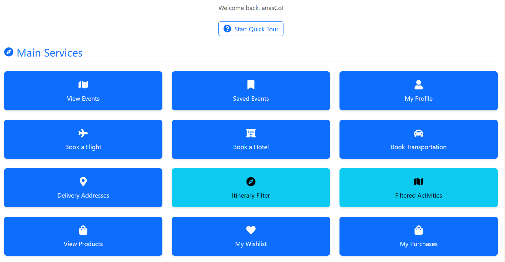
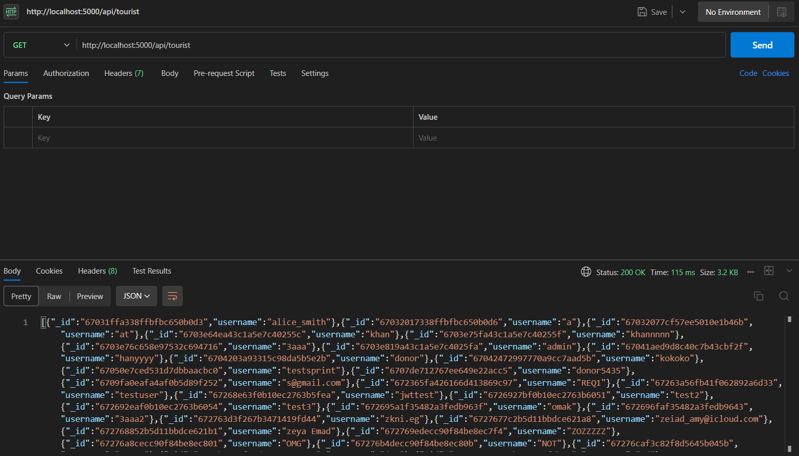

<p align="center">
  <!-- Local Logo Image -->
  

  <!-- Typing SVG -->
  <a href="https://git.io/typing-svg">
    
  </a>
</p>


# Tripify: a Tourism Management System

## Table of Contents

1. [🚀 Motivation](#-motivation)
2. [🧱 Build Status](#-build-status)
3. [🎨 Code Style](#-code-style)
4. [⚒️ Tech and Frameworks used](#%EF%B8%8F-tech-and-frameworks-used)
5. [🔥 Features & Screenshots](#-features--screenshots)
6. [💻 Code Examples](#-code-examples)
7. [⚙️ Installation](#%EF%B8%8F-installation)
8. [📚 API Reference](#-api-reference)
9. [🧪 Tests](#-tests)
10. [🧑🏻‍🏫 How to Use](#-how-to-use)
11. [🤝 Contribute](#-contribute)
12. [©️ Credits](#-credits)
13. [📜 License](#-license)

## 🚀 Motivation

Welcome to Tripify! 🌍✨
Planning trips can often be a daunting task, with numerous details to manage and choices to make. We created Tripify to simplify and streamline this process for travelers. Our goal is to provide users with a one-stop platform to plan, book, and manage their travel itineraries effortlessly.

Whether you're a seasoned traveler looking for curated experiences or a first-timer seeking guidance, Tripify empowers you with tools and insights to make your journey memorable.

The motivation behind Tripify stems from a shared passion for travel and a desire to eliminate the frustration often associated with planning trips. By integrating advanced features, automation, and user-friendly design, we aim to inspire people to explore the world with confidence and ease.


## 👀 Quick Look

<div align="center">
  <!-- For GitHub-hosted .mp4 video -->
  <video width="600" controls>
    <source src="assets/tripify-preview.mp4" type="video/mp4">
    Your browser does not support the video tag.
  </video>
  </div>


Experience Tripify in action! This quick preview showcases our key features:
- User-friendly registration and authentication
- Seamless booking experience
- Interactive itinerary planning
- Real-time notifications
- And much more!


## 🧱 Build Status

- Current Build Status: Under active development, not yet stable for production use.
- Known Issues: Please check the **Issues** section for a list of reported bugs or feature requests.
- Automated Tests: We plan to add more automated tests in the future to improve reliability.
- Documentation: Additional documentation is in progress to provide more details on setup, features, and usage.

## 🎨 Code Style

We use [Prettier](https://prettier.io/) and [ESLint](https://eslint.org/) to enforce a consistent code style. We use an edited version of the default ESLint TypeScript config. You can check the config in the [.eslintrc.js](.eslintrc.js) file.

<details>
<summary>Useful Commands</summary>

### Useful Commands

- Check formatting using Prettier

```bash
npm run format
```

- And then fix formatting using Prettier

```bash
npm run format:fix
```

- Check linting using ESLint

```bash
npm run lint
```

- And then fix linting using ESLint

```bash
npm run lint:fix
```

- Check compilation of all subpackages using TypeScript

```bash
npm run compile:all
```

</details>

## ⚒️ Tech and Frameworks used

- [NodeJs](https://nodejs.org/en/)
- [Express](https://expressjs.com/)
- [ReactJs](https://reactjs.org/)
- [MongoDB](https://www.mongodb.com/)
- [Mongoose](https://mongoosejs.com/)
- [ESLint](https://eslint.org/)
- [Prettier](https://prettier.io/)
- [jwt-decode](https://www.npmjs.com/package/jwt-decode)
- [Bootstrap](https://react-bootstrap.netlify.app/)
- [Framer](https://www.npmjs.com/package/framer-motion)
- [React Router](https://reactrouter.com/)
- [React Hook Form](https://react-hook-form.com/)
- [React Query](https://react-query.tanstack.com/)
- [NodeMailer](https://nodemailer.com/about/)
- [Bcrypt](https://www.npmjs.com/package/bcrypt)
- [Postman](https://www.postman.com/)
- [jwt](https://jwt.io/introduction)
- [mutler](https://www.npmjs.com/package/multer)
- [fs](https://www.npmjs.com/package/fs)

## 🔥 Features & Screenshots

<details>
<summary>User Registration 📝</summary>

- Register as a Tourist,Tour Guide, Advertiser or A Seller each with their essential and required documents.
- Upload/remove licensce for tour guide or permit for Seller/Advertiser(PDF, JPEG, JPG, PNG).
- Submit a request to register as a Tour Guide/Seller?Advertiser with professional details.
- Upload required documents for Tour Guide registration.

</details>

<details>
<summary>User Authentication 🔐</summary>
- Login and logout securely.


</details>

</details>

<details>
<summary>Administrator Functions 👩‍💼</summary>
- Add/remove another administrator.
- Manage Users and accounts.
- Accept or reject Tour Guide/Seller/Advertiser registration requests.
- View information uploaded by Tour Guide/Seller/Advertiser.
- Moderate and flag/unflag content.
- Add Prodcuts to the website.
- Get notified whenever a product runs out os stock
- View Complaints of Users
- Add or Remove a Promo Code
- View a Sales Report


</details>


<details>
<summary>Account Management 🔄</summary>
- Change password.
- Reset forgotten password via email.
- Edit/update editable User info with respect to the account type.


</details>

<details>
<summary>Tourist Functions </summary>
- View/Book Upcoming Events.
- View/Purchase Items
- Rate Purchased Items, Tour Guides , Sellers and activities
- Cancel Booked Events
- Book Flights/Hotels/Transportation
- Create a wishlist and add to it
- File a complaint
- Receive a refund in the wallet for canceled appointments.
- View the amount in the wallet.
- Add/Edit Delivery Address.
- Pay with Card/Wallet/Cash on Delivery
- Earn and Redeem loyalty points for cash



</details>

<details>
<summary>Tour Guide Functions </summary>
- View/Add/Edit/Remove Itineraries
- View The Sales Report of Booked Events
- Edit Profile and Upload a Profile Picture


</details>

<details>
<summary>Advertiser Functions 📅</summary>
- View/Create/Edit/Delete activities.
- View/Create/Edit/Delete Transportation Services.
- View a Sales Report of your Activites and how frequently they were booked.


</details>

<details>
<summary>Tourism Governor Functions 💊</summary>
- View/Create/Edit/Delete Historical Places
- View/Create/Edit/Delete Tags for Histroical Places


</details>

<details>
<summary>Seller Functions 💰</summary>
- Accept and View the Terms and Conditions.
- Add/Edit/Remove a Product.
- View A Sales report of last product sales.
- Upload a product image.


</details>

<details>
<summary>General User 📬</summary>
- All users are authenticated and can change their password, delete their account and have general rights
- All users must accept the terms and conditons before they start using the system.
  
</details>

## 💻 Code Examples

<details>
<summary>BE Routes Example</summary>

```js
app.use("/api/tourist", touristRoutes);
app.use("/api/tourguide", tourguideRoutes);
app.use("/api/toursimGovernor", tourismGovernorRoutes);

app.use("/api/seller", sellerRoutes);
app.use("/api/admin", adminRoutes);
app.use("/api/advertiser", advertiserRoutes);
app.use("/api/preference-tags", preferenceTagRoutes);
app.use("/api/tags", tagRoutes);
app.use("/api/products", productRoutes);
app.use("/api/complaints", complaintRoutes);
app.use("/api/flights", flightRoutes);
app.use("/api/hotels", hotelRoutes);
app.use("/api/bookings", bookingRoutes);

app.use("/api/transportation", transportationRoutes);
app.use("/api/notifications", notificationRoutes);
app.use("/api/stripe", stripeRoutes);
app.use('/api/wishlist', wishlistRoutes);

```

</details>

<details>
<summary>BE Deduct funds Tourist Controller Example</summary>

```js
export const deductFromWallet = async (req, res) => {
  try {
    const { id } = req.params;
    const { amount } = req.body;

    console.log("Deduct from wallet request:", {
      userId: id,
      amount,
      body: req.body,
    });

    if (!amount || amount <= 0) {
      console.log("Invalid amount:", amount);
      return res.status(400).json({ message: "Invalid amount" });
    }

    const tourist = await Tourist.findById(id);
    if (!tourist) {
      console.log("Tourist not found:", id);
      return res.status(404).json({ message: "Tourist not found" });
    }

    console.log("Current wallet balance:", tourist.wallet);
    console.log("Attempting to deduct:", amount);

    if (tourist.wallet < amount) {
      console.log("Insufficient funds:", {
        balance: tourist.wallet,
        required: amount,
      });

      return res.status(400).json({
        message: "Insufficient funds",
        currentBalance: tourist.wallet,
        requiredAmount: amount,
      });
    }
    // Calculate and add loyalty points based on level
    const earnedPoints = calculateLoyaltyPoints(tourist.level, amount);
    tourist.loyaltypoints += earnedPoints;

    // Update tourist level based on total points
    tourist.level = determineTouristLevel(tourist.loyaltypoints);

    tourist.wallet = tourist.wallet - amount;
    await tourist.save();

    console.log("New wallet balance:", tourist.wallet);

    res.status(200).json({
      success: true,
      message: "Amount deducted from wallet successfully",
      currentBalance: tourist.wallet,
      earnedPoints,
      totalPoints: tourist.loyaltypoints,
      newLevel: tourist.level,
    });
  } catch (error) {
    console.error("Deduct from wallet error:", error);
    res.status(500).json({
      message: "Server error",
      error: error.message,
      stack: process.env.NODE_ENV === "development" ? error.stack : undefined,
    });
  }
};
```

</details>

<details>
<summary>BE Create a Promo Code Admin Controller Example</summary>

```js

export const createPromoCode = async (req, res) => {
  const { code, discount, expiryDate, usageLimit } = req.body;

  if (!code || !discount || !expiryDate || !usageLimit) {
    return res.status(400).json({ message: "All fields are required" });
  }

  try {
    // Check if promo code already exists
    const existingPromoCode = await PromoCode.findOne({ code });
    if (existingPromoCode) {
      return res.status(400).json({ message: "Promo code already exists" });
    }

    // Create new promo code
    const newPromoCode = new PromoCode({
      code,
      discount,
      expiryDate,
      usageLimit,
    });

    await newPromoCode.save();
    res.status(201).json({
      message: "Promo code created successfully",
      promoCode: newPromoCode,
    });
  } catch (error) {
    res.status(500).json({ message: "Error creating promo code", error });
  }
};
```

</details>

<details>
<summary>BE Send Emails To Users Example</summary>

```js
import nodemailer from "nodemailer";
import dotenv from "dotenv";
dotenv.config();

// Create a transporter using Brevo's SMTP server
const sendEmail = async (to, subject, text, html = "") => {
  try {
    const transporter = nodemailer.createTransport({
      host: "smtp-relay.brevo.com",  // Brevo's SMTP server
      port: 587,  // STARTTLS
      secure: false,  // false for STARTTLS
      auth: {
        user: process.env.BREVO_EMAIL,  // Your Brevo email address (configured in .env)
        pass: process.env.BREVO_API_KEY,  // Your Brevo API key (configured in .env)
      },
    });

    const mailOptions = {
      from: "tripify11@outlook.com",  // Hardcoded sender email
      to,  // Recipient(s)
      subject,  // Subject line
      text,  // Plain text body
      html,  // Optional: HTML body
    };

    const info = await transporter.sendMail(mailOptions);
    console.log("Email sent: ", info.response);
  } catch (error) {
    console.error("Error sending email: ", error);
    throw error;
  }
};

export default sendEmail;

```

</details>

<details>
<summary>BE Activity Package Model Example</summary>

```js
import mongoose from "mongoose";

const activitySchema = new mongoose.Schema(
  {
    name: {
      type: String,
      required: true,
      trim: true,
    },
    description: {
      type: String,
      required: true,
      trim: true,
    },
    date: {
      type: Date,
      required: true,
    },
    time: {
      type: String,
      required: true,
    },
    price: {
      type: Number,
      required: true,
    },
    category: {
      type: mongoose.Schema.Types.ObjectId,
      ref: "ActivityCategory",
      required: true,
    },
    tags: [
      {
        type: mongoose.Schema.Types.ObjectId,
        ref: "Tag",
      },
    ],
    discounts: {
      type: String,
    },
    bookingOpen: {
      type: Boolean,
      default: false,
    },
    location: {
      type: {
        type: String,
        enum: ["Point"],
        required: true,
      },
      coordinates: {
        type: [Number],
        required: true,
      },
    },
    createdBy: {
      type: mongoose.Schema.Types.ObjectId,
      ref: "Advertiser",
      required: true,
    },
    flagged: {
      type: Boolean,
      default: false,
      required: true,
    },
  },

  { timestamps: true }
);

activitySchema.index({ location: "2dsphere" });

const Activity = mongoose.model("Activity", activitySchema);
export default Activity;

```

</details>

<details>
<summary>Birthday Promo Code Generator Example</summary>

```js
export const checkAndSendBirthdayPromos = async () => {
  try {
    const today = new Date();
    console.log('Checking for birthdays:', {
      month: today.getMonth() + 1,
      day: today.getDate()
    });

    // Updated query to use dob instead of birthDate
    const users = await Tourist.find({
      $expr: {
        $and: [
          { $eq: [{ $month: '$dob' }, today.getMonth() + 1] },
          { $eq: [{ $dayOfMonth: '$dob' }, today.getDate()] }
        ]
      }
    });

    console.log('Found users with birthdays:', users);

    const results = await Promise.all(users.map(createAndSendBirthdayPromo));
    return results;
  } catch (error) {
    console.error('Error processing birthday promos:', error);
    throw error;
  }
};
```

</details>

<details>
<summary>FE Admin Dashboard Routes Example</summary>

```js
<Route path="/admin" element={<AdminHomePage />} />
          <Route path="/admin/manage-users" element={<ListUsers />} />
          <Route
            path="/admin/activity-categories"
            element={<ActivityCategoryManagement />}
          />
          <Route
            path="/admin/forgot-password"
            element={<ForgetPasswordAdmin />}
          />
          <Route path="/admin/promo-codes" element={<PromoCodeManager />} />
          <Route
            path="/admin/preference-tags"
            element={<PreferenceTagManagement />}
          />
          <Route path="/admin/complaints" element={<Complaints />} />
          <Route
            path="/admin/content-moderation"
            element={<ContentModeration />}
          />
          <Route path="/admin/view-documents" element={<ViewDocuemnts />} />
          <Route
            path="/admin/change-password"
            element={<AdminChangePassword />}
          />
          <Route path="/admin/sales-report" element={<AdminSalesReport />} />
          
```

</details>

<details>
<summary>FE Tourist Dashboard Page Routes Example</summary>

```js
   {/* Tourist Routes */}
          <Route path="/tourist" element={<TouristHomePage />} />
          <Route path="/tourist/register" element={<TouristRegister />} />
          <Route path="/tourist/view-events" element={<ViewEvents />} />
          <Route path="/tourist/my-profile" element={<MyProfile />} />
          <Route
            path="/tourist/forgot-password"
            element={<ForgetPasswordTourist />}
          />
          <Route
            path="/tourist/my-complaints"
            element={<TouristComplaints />}
          />
          <Route
            path="/tourist/itinerary-filter"
            element={<ItineraryFilter />}
          />
          <Route
            path="/tourist/filtered-activities"
            element={<FilteredActivities />}
          />
          <Route path="/tourist/wishlist" element={<WishlistPage />} />
          <Route path="/tourist/products" element={<ProductTouristPage />} />
          <Route path="/tourist/purchases" element={<MyPurchasesPage />} />
          <Route path="/tourist/complaints" element={<CreateComplaint />} />
          <Route path="/tourist/book-flight" element={<FlightBooking />} />
          <Route path="/tourist/book-hotel" element={<HotelBooking />} />
          <Route path="/tourist/saved-events" element={<SavedEvents />} />
          <Route
            path="/tourist/notifications"
            element={<NotificationsPage />}
          />
          <Route path="/tourist/guide" element={<VacationGuide />} />
          <Route
            path="/tourist/hotel-bookings"
            element={<HotelBookings />}
          />{" "}
          <Route path="/tourist/view-bookings" element={<ViewBookings />} />
          <Route
            path="/tourist/book-transportation"
            element={<BookTransportation />}
          />
          <Route
            path="/tourist/change-password"
            element={<TouristChangePassword />}
          />
          {/* Review System Routes */}
          <Route
            path="/tourist/reviews/tour-guides"
            element={<RateTourGuides />}
          />
          <Route
            path="/tourist/delivery-addresses"
            element={<DeliveryAddresses />}
          />
          <Route path="/tourist/reviews/events" element={<EventReviews />} />
          <Route
            path="/tourist/reviews/products"
            element={<ProductReviews />}
          />
          <Route path="/tourist/my-reviews" element={<MyReviews />} />
          <Route path="/tourist/reviews" element={<ReviewsSystem />} />{" "}
       
```

</details>

## ⚙️ Installation

- Make sure you have [Node](https://nodejs.org/en) and [Git](https://git-scm.com/) installed

- Make a new folder for the sub system of Tripify

```bash
mkdir Tripify
cd Tripify
```

- Clone this repo 

```bash
git clone https://github.com/Advanced-computer-lab-2024/Tripify
```

- Install dependencies for frontend

```bash
cd Tripify/frontend
npm install
```

- Install dependencies for backend

```bash
cd Tripify/backend
npm install
```

## 📚 API Reference

<details>
<summary>Admin Endpoints</summary>

### Register Admin
- **POST** `/api/admin/register`
- **Description**: Register a new admin user
- **Request Body**:
  ```json
  {
    "username": "string",
    "email": "string",
    "password": "string"
  }
  ```
- **Response**: 
  - Status: 201 Created
  ```json
  {
    "message": "Admin registered successfully",
    "admin": {
      "id": "string",
      "username": "string",
      "email": "string"
    },
    "token": "string"
  }
  ```

### Login Admin
- **POST** `/api/admin/login`
- **Description**: Authenticate an admin user
- **Request Body**:
  ```json
  {
    "username": "string", // Can be username or email
    "password": "string"
  }
  ```
- **Response**:
  - Status: 200 OK
  ```json
  {
    "message": "Login successful",
    "admin": {
      "id": "string",
      "username": "string",
      "email": "string"
    },
    "token": "string"
  }
  ```

### Change Password
- **POST** `/api/admin/change-password`
- **Description**: Change admin's password (requires authentication)
- **Request Body**:
  ```json
  {
    "currentPassword": "string",
    "newPassword": "string"
  }
  ```
- **Response**:
  - Status: 200 OK
  ```json
  {
    "message": "Password updated successfully"
  }
  ```

## User Management Endpoints

### List All Users
- **GET** `/api/admin/users`
- **Description**: Get list of all users across all user types (requires admin authentication)
- **Response**:
  - Status: 200 OK
  ```json
  [
    {
      "username": "string",
      "email": "string",
      "userType": "string", // "Tour Guide" | "Tourist" | "Advertiser" | "Seller" | "Admin"
      "_id": "string",
      // Other user properties...
    }
  ]
  ```

### Delete User
- **DELETE** `/api/admin/users`
- **Description**: Delete a user of any type (requires admin authentication)
- **Request Body**:
  ```json
  {
    "userId": "string",
    "userType": "string" // "Tour Guide" | "Tourist" | "Advertiser" | "Seller" | "Admin"
  }
  ```
- **Response**:
  - Status: 200 OK
  ```json
  {
    "message": "User deleted successfully",
    "deletedUser": {
      "id": "string",
      "userType": "string",
      "email": "string",
      "username": "string"
    }
  }
  ```

## Verification Endpoints

### Get Unverified Users
- **GET** `/api/admin/unverified/api/seller` - Get unverified sellers
- **GET** `/api/admin/unverified/api/advertiser` - Get unverified advertisers
- **GET** `/api/admin/unverified/tour-guides` - Get unverified tour guides
- **Response**:
  - Status: 200 OK
  ```json
  [
    {
      "username": "string",
      "email": "string",
      "createdAt": "date",
      "isVerified": false,
      // Documents specific to user type...
    }
  ]
  ```

### Verify Users
- **POST** `/api/admin/verify/seller/:id`
- **POST** `/api/admin/verify/advertiser/:id`
- **POST** `/api/admin/verify/tour-guide/:id`
- **Request Body**:
  ```json
  {
    "isApproved": "boolean"
  }
  ```
- **Response**:
  - Status: 200 OK
  ```json
  {
    "message": "User approved/rejected successfully"
  }
  ```

## Promo Code Management

### Create Promo Code
- **POST** `/api/admin/promo-codes`
- **Request Body**:
  ```json
  {
    "code": "string",
    "discount": "number",
    "expiryDate": "date",
    "usageLimit": "number"
  }
  ```
- **Response**:
  - Status: 201 Created
  ```json
  {
    "message": "Promo code created successfully",
    "promoCode": {
      // Promo code details
    }
  }
  ```

### Update Promo Code
- **PUT** `/api/admin/promo-codes/:id`
- **Request Body**:
  ```json
  {
    "code": "string",
    "discount": "number",
    "expiryDate": "date",
    "usageLimit": "number",
    "isActive": "boolean"
  }
  ```

### Delete Promo Code
- **DELETE** `/api/admin/promo-codes/:id`

### Get All Promo Codes
- **GET** `/api/admin/promo-codes`

## Sales and Statistics

### Get User Statistics
- **GET** `/api/admin/stats/users`
- **Response**:
  ```json
  {
    "totalUsers": "number",
    "newUsersThisMonth": "number"
  }
  ```

### Get Sales Data
- **GET** `/api/admin/sales/itineraries` - Get itinerary sales
- **GET** `/api/admin/sales/activities` - Get activity sales
- **GET** `/api/admin/sales/products` - Get product sales
- **GET** `/api/admin/sales/historical-places` - Get historical place sales
- **Response**:
  ```json
  [
    {
      "purchaseDate": "date",
      "totalPrice": "number",
      "itemName": "string",
      "bookingId/purchaseId": "string"
    }
  ]
  ```

## Password Reset Flow

### Send Password Reset OTP
- **POST** `/api/admin/send-password-reset-otp`
- **Request Body**:
  ```json
  {
    "email": "string"
  }
  ```

### Verify Password Reset OTP
- **POST** `/api/admin/verify-password-reset-otp`
- **Request Body**:
  ```json
  {
    "email": "string",
    "otp": "string"
  }
  ```

### Reset Password
- **POST** `/api/admin/reset-password`
- **Request Body**:
  ```json
  {
    "email": "string",
    "newPassword": "string"
  }
  ```
</details>

<details>
<summary>Tourist Endpoints</summary>

### Register Tourist
- **POST** `/api/tourist/register`
- **Description**: Register a new tourist user
- **Request Body**:
  ```json
  {
    "email": "string",
    "username": "string",
    "password": "string",
    "mobileNumber": "string",
    "nationality": "string",
    "dob": "date",
    "jobStatus": "student" | "job",
    "jobTitle": "string" // Required if jobStatus is "job"
  }
  ```
- **Response**: 
  - Status: 201 Created
  ```json
  {
    "message": "Tourist registered successfully",
    "tourist": {
      "id": "string",
      "email": "string",
      "username": "string",
      "mobileNumber": "string",
      "nationality": "string",
      "dob": "date",
      "jobStatus": "string",
      "jobTitle": "string",
      "wallet": 0
    },
    "token": "string"
  }
  ```

### Login Tourist
- **POST** `/api/tourist/login`
- **Description**: Authenticate a tourist user
- **Request Body**:
  ```json
  {
    "username": "string", // Can be username or email
    "password": "string"
  }
  ```
- **Response**:
  - Status: 200 OK
  ```json
  {
    "message": "Login successful",
    "tourist": {
      "id": "string",
      "email": "string",
      "username": "string",
      "mobileNumber": "string",
      "nationality": "string",
      "dob": "date",
      "jobStatus": "string",
      "jobTitle": "string",
      "wallet": "number",
      "preferences": "object"
    },
    "token": "string"
  }
  ```

### Change Password
- **POST** `/api/tourist/change-password`
- **Description**: Change tourist's password (requires authentication)
- **Request Body**:
  ```json
  {
    "currentPassword": "string",
    "newPassword": "string"
  }
  ```
- **Response**:
  - Status: 200 OK
  ```json
  {
    "message": "Password updated successfully"
  }
  ```

## Profile Management

### Get Tourist Profile
- **GET** `/api/tourist/:username`
- **Description**: Get tourist profile details (requires authentication)
- **Response**:
  ```json
  {
    "message": "Tourist profile fetched successfully",
    "tourist": {
      // Tourist profile details
    }
  }
  ```

### Update Tourist Profile
- **PUT** `/api/tourist/:username`
- **Description**: Update tourist profile (requires authentication)
- **Request Body**:
  ```json
  {
    "email": "string",
    "mobileNumber": "string",
    "nationality": "string",
    "jobStatus": "string",
    "jobTitle": "string",
    "preferences": "object"
  }
  ```

## Wallet Management

### Add to Wallet
- **POST** `/api/tourist/:id/wallet/add`
- **Request Body**:
  ```json
  {
    "amount": "number"
  }
  ```

### Deduct from Wallet
- **POST** `/api/tourist/:id/wallet/deduct`
- **Request Body**:
  ```json
  {
    "amount": "number"
  }
  ```

### Refund to Wallet
- **POST** `/api/tourist/:id/wallet/refund`
- **Request Body**:
  ```json
  {
    "amount": "number"
  }
  ```

## Loyalty Program

### Get Loyalty Status
- **GET** `/api/tourist/:id/loyalty`
- **Response**:
  ```json
  {
    "success": true,
    "loyaltyStatus": {
      "points": "number",
      "level": "number",
      "nextLevelPoints": "number",
      "pointsToNextLevel": "number"
    }
  }
  ```

### Redeem Loyalty Points
- **POST** `/api/tourist/:id/loyalty/redeem`
- **Request Body**:
  ```json
  {
    "pointsToRedeem": "number" // Must be multiple of 10,000
  }
  ```

## Delivery Address Management

### Add Delivery Address
- **POST** `/api/tourist/addresses`
- **Request Body**:
  ```json
  {
    "street": "string",
    "city": "string",
    "state": "string",
    "postalCode": "string",
    "isDefault": "boolean"
  }
  ```

### Get Delivery Addresses
- **GET** `/api/tourist/addresses`

### Update Delivery Address
- **PUT** `/api/tourist/addresses/:addressId`

### Delete Delivery Address
- **DELETE** `/api/tourist/addresses/:addressId`

### Set Default Address
- **PUT** `/api/tourist/addresses/:addressId/default`

## Bookmarks

### Bookmark Event
- **POST** `/api/tourist/bookmarks`
- **Request Body**:
  ```json
  {
    "eventId": "string",
    "eventType": "HistoricalPlace" | "Activity" | "Itinerary"
  }
  ```

### Get Saved Events
- **GET** `/api/tourist/bookmarks`

### Remove Bookmark
- **DELETE** `/api/tourist/bookmarks/:eventId`

## Reviews

### Rate Tour Guide
- **POST** `/api/tourist/tour-guides/:tourGuideId/rate`
- **Request Body**:
  ```json
  {
    "rating": "number", // 1-5
    "comment": "string"
  }
  ```

## Account Management

### Check Deletion Eligibility
- **GET** `/api/tourist/:id/deletion-eligibility`

### Delete Account
- **DELETE** `/api/tourist/:id`

## Password Reset

### Send Password Reset OTP
- **POST** `/api/tourist/send-password-reset-otp`
- **Request Body**:
  ```json
  {
    "email": "string"
  }
  ```

### Verify Password Reset OTP
- **POST** `/api/tourist/verify-password-reset-otp`
- **Request Body**:
  ```json
  {
    "email": "string",
    "otp": "string"
  }
  ```

### Reset Password
- **POST** `/api/tourist/reset-password`
- **Request Body**:
  ```json
  {
    "email": "string",
    "newPassword": "string"
  }
  ```
  </details>

<details>
<summary>Tour Guide Endpoints</summary>
# Tour Guide API Documentation

## Authentication Endpoints

### Register Tour Guide
- **POST** `/api/tourguide/register`
- **Description**: Register a new tour guide
- **Content Type**: `multipart/form-data`
- **Request Body**:
  ```json
  {
    "username": "string",
    "email": "string",
    "password": "string",
    "mobileNumber": "string",
    "yearsOfExperience": "number",
    "previousWork": "array"
  }
  ```
- **Required Files**:
  - `identificationDocument`: File
  - `certificate`: File
- **Response**: 
  - Status: 201 Created
  ```json
  {
    "message": "Tour guide registered successfully",
    "tourguide": {
      "id": "string",
      "username": "string",
      "email": "string",
      "mobileNumber": "string",
      "yearsOfExperience": "number",
      "previousWork": "array",
      "identificationDocument": "string",
      "certificate": "string",
      "TandC": "boolean"
    },
    "token": "string"
  }
  ```

### Login Tour Guide
- **POST** `/api/tourguide/login`
- **Description**: Authenticate a tour guide
- **Request Body**:
  ```json
  {
    "username": "string", // Can be username or email
    "password": "string"
  }
  ```
- **Response**:
  - Status: 200 OK
  ```json
  {
    "message": "Login successful",
    "tourguide": {
      "id": "string",
      "username": "string",
      "email": "string",
      "mobileNumber": "string",
      "yearsOfExperience": "number",
      "previousWork": "array",
      "TandC": "boolean"
    },
    "token": "string"
  }
  ```

## Profile Management

### Get Tour Guide Profile
- **GET** `/api/tourguide/:username`
- **Description**: Get tour guide profile by username (requires authentication)
- **Response**: Profile data excluding password

### Get Profile by Token
- **GET** `/api/tourguide/profile`
- **Description**: Get tour guide profile using JWT token (requires authentication)
- **Response**:
  ```json
  {
    "message": "Profile fetched successfully",
    "tourGuide": {
      "id": "string",
      "username": "string",
      "email": "string",
      "mobileNumber": "string",
      "yearsOfExperience": "number",
      "previousWork": "array",
      "TandC": "boolean"
    }
  }
  ```

### Update Profile
- **PUT** `/api/tourguide/:username`
- **Description**: Update tour guide profile (requires authentication)
- **Request Body**:
  ```json
  {
    "email": "string",
    "mobileNumber": "string",
    "yearsOfExperience": "number",
    "previousWork": [
      {
        "jobTitle": "string",
        "company": "string",
        "description": "string",
        "startDate": "date",
        "endDate": "date"
      }
    ],
    "TandC": "boolean"
  }
  ```

### Upload Profile Picture
- **POST** `/api/tourguide/profile-picture`
- **Description**: Upload or update profile picture (requires authentication)
- **Content Type**: `multipart/form-data`
- **Request Body**:
  - `profilePicture`: File
- **Response**:
  ```json
  {
    "message": "Profile picture uploaded successfully",
    "profilePicture": {
      "filename": "string",
      "path": "string",
      "mimetype": "string",
      "size": "number",
      "uploadDate": "date"
    }
  }
  ```

## Password Management

### Change Password
- **POST** `/api/tourguide/change-password`
- **Description**: Change tour guide password (requires authentication)
- **Request Body**:
  ```json
  {
    "currentPassword": "string",
    "newPassword": "string"
  }
  ```

### Send Password Reset OTP
- **POST** `/api/tourguide/send-password-reset-otp`
- **Request Body**:
  ```json
  {
    "email": "string"
  }
  ```

### Verify Password Reset OTP
- **POST** `/api/tourguide/verify-password-reset-otp`
- **Request Body**:
  ```json
  {
    "email": "string",
    "otp": "string"
  }
  ```

### Reset Password
- **POST** `/api/tourguide/reset-password`
- **Request Body**:
  ```json
  {
    "email": "string",
    "newPassword": "string"
  }
  ```

## Itinerary Management

### Get Tour Guide Itineraries
- **GET** `/api/tourguide/itineraries`
- **Description**: Get all itineraries created by the tour guide (requires authentication)
- **Response**: Array of itineraries with preference tags, sorted by creation date

## Account Management

### Get All Tour Guides
- **GET** `/api/tourguide`
- **Description**: Get list of all tour guides
- **Response**: Array of tour guide profiles (excluding passwords)

### Delete Account
- **DELETE** `/api/tourguide/:id`
- **Description**: Delete tour guide account (requires authentication)
- **Side Effects**:
  - All associated itineraries are marked as inactive
  - Tour guide profile and related data are deleted
</details>

<details>
<summary>Seller Endpoints</summary>
# Seller API Documentation

## Authentication Endpoints

### Register Seller
- **POST** `/api/seller/register`
- **Description**: Register a new seller
- **Content Type**: `multipart/form-data`
- **Request Body**:
  ```json
  {
    "username": "string",
    "email": "string",
    "password": "string",
    "name": "string",
    "description": "string",
    "mobileNumber": "string"
  }
  ```
- **Required Files**:
  - `businessLicense`: File
  - `identificationDocument`: File
- **Response**: 
  - Status: 201 Created
  ```json
  {
    "message": "Seller registered successfully",
    "seller": {
      "id": "string",
      "username": "string",
      "email": "string",
      "name": "string",
      "description": "string",
      "mobileNumber": "string",
      "businessLicense": "string",
      "identificationDocument": "string",
      "TandC": "boolean"
    },
    "token": "string"
  }
  ```

### Login Seller
- **POST** `/api/seller/login`
- **Description**: Authenticate a seller
- **Request Body**:
  ```json
  {
    "username": "string", // Can be username or email
    "password": "string"
  }
  ```
- **Response**:
  - Status: 200 OK
  ```json
  {
    "message": "Login successful",
    "seller": {
      "id": "string",
      "username": "string",
      "email": "string",
      "name": "string",
      "description": "string"
    },
    "token": "string"
  }
  ```

## Profile Management

### Get Seller Profile
- **GET** `/api/seller/:username`
- **Description**: Get seller profile (requires authentication)
- **Response**:
  ```json
  {
    "seller": {
      "id": "string",
      "username": "string",
      "email": "string",
      "name": "string",
      "description": "string"
    }
  }
  ```

### Update Seller Profile
- **PUT** `/api/seller/:id`
- **Description**: Update seller profile (requires authentication)
- **Request Body**:
  ```json
  {
    "username": "string",
    "email": "string",
    "name": "string",
    "description": "string",
    "TandC": "boolean"
  }
  ```
- **Response**:
  ```json
  {
    "message": "Seller updated successfully",
    "seller": {
      "id": "string",
      "username": "string",
      "email": "string",
      "name": "string",
      "description": "string",
      "TandC": "boolean"
    }
  }
  ```

## Password Management

### Change Password
- **POST** `/api/seller/change-password`
- **Description**: Change seller password (requires authentication)
- **Request Body**:
  ```json
  {
    "currentPassword": "string",
    "newPassword": "string"
  }
  ```

### Send Password Reset OTP
- **POST** `/api/seller/send-password-reset-otp`
- **Request Body**:
  ```json
  {
    "email": "string"
  }
  ```

### Verify Password Reset OTP
- **POST** `/api/seller/verify-password-reset-otp`
- **Request Body**:
  ```json
  {
    "email": "string",
    "otp": "string"
  }
  ```

### Reset Password
- **POST** `/api/seller/reset-password`
- **Request Body**:
  ```json
  {
    "email": "string",
    "newPassword": "string"
  }
  ```

## Account Management

### Get All Sellers
- **GET** `/seller`
- **Description**: Get list of all sellers
- **Response**: Array of seller profiles (excluding passwords)

### Delete Account
- **DELETE** `/seller/:id`
- **Description**: Delete seller account (requires authentication)
- **Response**:
  ```json
  {
    "message": "Seller account deleted successfully"
  }
  ```

## Error Responses

Common error responses across all endpoints:

### Authentication Errors
- Status: 401 Unauthorized
  ```json
  {
    "message": "Invalid username or password"
  }
  ```
- Status: 403 Forbidden
  ```json
  {
    "message": "Unauthorized access"
  }
  ```

### Resource Errors
- Status: 404 Not Found
  ```json
  {
    "message": "Seller not found"
  }
  ```

### Validation Errors
- Status: 400 Bad Request
  ```json
  {
    "message": "Error message describing the validation failure"
  }
  ```

### Server Errors
- Status: 500 Internal Server Error
  ```json
  {
    "message": "Error message describing the problem",
    "error": "Detailed error information"
  }
  ```
</details>

<details>
<summary>Tourism Governor Endpoints</summary>

### Register Tourism Governor
- **POST** `/api/tourismGovernor/register`
- **Description**: Register a new tourism governor
- **Request Body**:
  ```json
  {
    "username": "string",
    "email": "string",
    "password": "string"
  }
  ```
- **Response**: 
  - Status: 201 Created
  ```json
  {
    "message": "Tourism Governor registered successfully",
    "governor": {
      "id": "string",
      "username": "string",
      "email": "string"
    },
    "token": "string"
  }
  ```

### Login Tourism Governor
- **POST** `/api/tourismGovernor/login`
- **Description**: Authenticate a tourism governor
- **Request Body**:
  ```json
  {
    "username": "string", // Can be username or email
    "password": "string"
  }
  ```
- **Response**:
  - Status: 200 OK
  ```json
  {
    "message": "Login successful",
    "governor": {
      "id": "string",
      "username": "string",
      "email": "string"
    },
    "token": "string"
  }
  ```

## Profile Management

### Get Governor Profile
- **GET** `/api/tourismGovernor/profile`
- **Description**: Get tourism governor profile (requires authentication)
- **Response**:
  ```json
  {
    "message": "Profile retrieved successfully",
    "governor": {
      // Governor profile details excluding password
    }
  }
  ```

### Update Governor Profile
- **PUT** `/api/tourismGovernor/profile`
- **Description**: Update tourism governor profile (requires authentication)
- **Request Body**: Any profile fields to update (password, _id, and role cannot be updated)
- **Response**:
  ```json
  {
    "message": "Profile updated successfully",
    "governor": {
      // Updated governor profile
    }
  }
  ```

### Get All Governors
- **GET** `/api/tourismGovernor`
- **Description**: Get list of all tourism governors
- **Optional Parameter**: `:id` - Get specific governor by ID
- **Response**: Array of governor profiles or single governor profile

## Password Management

### Change Password
- **POST** `/api/tourismGovernor/change-password`
- **Description**: Change governor's password (requires authentication)
- **Request Body**:
  ```json
  {
    "currentPassword": "string",
    "newPassword": "string"
  }
  ```

### Send Password Reset OTP
- **POST** `/api/tourismGovernor/send-password-reset-otp`
- **Request Body**:
  ```json
  {
    "email": "string"
  }
  ```

### Verify Password Reset OTP
- **POST** `/api/tourismGovernor/verify-password-reset-otp`
- **Request Body**:
  ```json
  {
    "email": "string",
    "otp": "string"
  }
  ```

### Reset Password
- **POST** `/api/tourismGovernor/reset-password`
- **Request Body**:
  ```json
  {
    "email": "string",
    "newPassword": "string"
  }
  ```

## Historical Places Management

### Get Governor's Places
- **GET** `/api/tourismGovernor/places`
- **Description**: Get all historical places created by the governor (requires authentication)
- **Response**:
  ```json
  {
    "message": "Places retrieved successfully",
    "places": [
      // Array of historical places with tags populated
    ]
  }
  ```

### Create Historical Place
- **POST** `/api/tourismGovernor/places`
- **Description**: Create a new historical place (requires authentication)
- **Request Body**: Historical place details
- **Response**:
  ```json
  {
    "message": "Historical place created successfully",
    "place": {
      // Created place details with tags and creator populated
    }
  }
  ```

### Update Historical Place
- **PUT** `/api/tourismGovernor/places/:id`
- **Description**: Update a historical place (requires authentication)
- **Request Body**: Fields to update
- **Response**:
  ```json
  {
    "message": "Historical place updated successfully",
    "place": {
      // Updated place details
    }
  }
  ```

### Delete Historical Place
- **DELETE** `/api/tourismGovernor/places/:id`
- **Description**: Delete a historical place (requires authentication)
- **Response**:
  ```json
  {
    "message": "Historical place deleted successfully"
  }
  ```

## Error Responses

### Authentication Errors
- Status: 401 Unauthorized
  ```json
  {
    "message": "Invalid credentials"
  }
  ```
- Status: 403 Forbidden
  ```json
  {
    "message": "Unauthorized access"
  }
  ```

### Resource Errors
- Status: 404 Not Found
  ```json
  {
    "message": "Tourism Governor not found"
  }
  ```
- Status: 404 Not Found
  ```json
  {
    "message": "Historical place not found or unauthorized"
  }
  ```

### Validation Errors
- Status: 400 Bad Request
  ```json
  {
    "message": "Error description"
  }
  ```

### Server Errors
- Status: 500 Internal Server Error
  ```json
  {
    "message": "Error description",
    "error": "Detailed error message"
  }
  ```
</details>

<details>
<summary>Advertiser Endpoints</summary>


## Authentication Endpoints

### Register Advertiser
- **POST** `/api/advertiser/register`
- **Description**: Register a new advertiser
- **Content Type**: `multipart/form-data`
- **Request Body**:
  ```json
  {
    "username": "string",
    "email": "string",
    "password": "string",
    "companyName": "string",
    "companyDescription": "string",
    "website": "string",
    "hotline": "string"
  }
  ```
- **Required Files**:
  - `businessLicense`: File
  - `identificationDocument`: File
- **Response**: 
  - Status: 201 Created
  ```json
  {
    "message": "Advertiser registered successfully",
    "advertiser": {
      "id": "string",
      "username": "string",
      "email": "string",
      "companyName": "string",
      "companyDescription": "string",
      "website": "string",
      "hotline": "string",
      "businessLicense": "string",
      "identificationDocument": "string"
    },
    "token": "string"
  }
  ```

### Login Advertiser
- **POST** `/api/advertiser/login`
- **Description**: Authenticate an advertiser
- **Request Body**:
  ```json
  {
    "username": "string", // Can be username or email
    "password": "string"
  }
  ```
- **Response**:
  - Status: 200 OK
  ```json
  {
    "message": "Login successful",
    "advertiser": {
      "id": "string",
      "username": "string",
      "email": "string",
      "companyName": "string",
      "companyDescription": "string",
      "website": "string",
      "hotline": "string",
      "companyLogo": "string"
    },
    "token": "string"
  }
  ```

## Profile Management

### Get Advertiser Profile
- **GET** `/api/advertiser/:username`
- **Description**: Get advertiser profile (requires authentication)
- **Response**:
  ```json
  {
    "id": "string",
    "username": "string",
    "email": "string",
    "companyName": "string",
    "companyDescription": "string",
    "website": "string",
    "hotline": "string",
    "companyLogo": "string",
    "TandC": "boolean"
  }
  ```

### Update Advertiser Profile
- **PUT** `/api/advertiser/:username`
- **Description**: Update advertiser profile (requires authentication)
- **Request Body**:
  ```json
  {
    "email": "string",
    "companyName": "string",
    "companyDescription": "string",
    "website": "string",
    "hotline": "string",
    "TandC": "boolean"
  }
  ```

## Password Management

### Change Password
- **POST** `/api/advertiser/change-password`
- **Description**: Change advertiser password (requires authentication)
- **Request Body**:
  ```json
  {
    "currentPassword": "string",
    "newPassword": "string"
  }
  ```

### Send Password Reset OTP
- **POST** `/api/advertiser/send-password-reset-otp`
- **Request Body**:
  ```json
  {
    "email": "string"
  }
  ```

### Verify Password Reset OTP
- **POST** `/api/advertiser/verify-password-reset-otp`
- **Request Body**:
  ```json
  {
    "email": "string",
    "otp": "string"
  }
  ```

### Reset Password
- **POST** `/api/advertiser/reset-password`
- **Request Body**:
  ```json
  {
    "email": "string",
    "newPassword": "string"
  }
  ```

## Activities Management

### Get Advertiser Activities
- **GET** `/api/advertiser/activities`
- **Description**: Get all activities created by the advertiser (requires authentication)
- **Response**: Array of activities with category and tags populated

### Get Sales Report
- **GET** `/api/advertiser/:id/sales-report`
- **Description**: Get sales report for advertiser's activities
- **Response**:
  ```json
  {
    "success": true,
    "data": {
      "bookings": [
        // Array of confirmed/attended bookings
      ],
      "activities": [
        // Array of non-flagged activities
      ]
    }
  }
  ```

## Account Management

### Get All Advertisers
- **GET** `/api/advertiser`
- **Description**: Get list of all advertisers
- **Response**: Array of advertiser profiles (excluding passwords)

### Get Advertiser by ID
- **GET** `/api/advertiser/:id`
- **Description**: Get specific advertiser by ID (requires authentication)
- **Response**: Advertiser profile with active ads populated

### Delete Account
- **DELETE** `/api/advertiser/:id`
- **Description**: Delete advertiser account (requires authentication)
- **Side Effects**:
  - All associated activities are marked as inactive
  - Advertiser profile and related data are deleted

## Error Responses

### Authentication Errors
- Status: 401 Unauthorized
  ```json
  {
    "message": "Invalid username or password"
  }
  ```
- Status: 403 Forbidden
  ```json
  {
    "message": "Unauthorized access"
  }
  ```

### Resource Errors
- Status: 404 Not Found
  ```json
  {
    "message": "Advertiser not found"
  }
  ```

### Validation Errors
- Status: 400 Bad Request
  ```json
  {
    "message": "Error description"
  }
  ```

### Server Errors
- Status: 500 Internal Server Error
  ```json
  {
    "message": "Error description",
    "error": "Detailed error message"
  }
  ```


</details>

<details>
<summary>Activity Endpoints</summary>
# Activity API Documentation

## Activity Management

### Create Activity
- **POST** `/activities`
- **Description**: Create a new activity
- **Request Body**: Activity details
  ```json
  {
    "name": "string",
    "category": "ObjectId",
    "tags": ["ObjectId"],
    "createdBy": "ObjectId", // Advertiser ID
    "description": "string",
    "price": "number",
    // Other activity fields
  }
  ```
- **Response**:
  - Status: 201 Created
  ```json
  {
    "_id": "string",
    "name": "string",
    "category": "ObjectId",
    "tags": ["ObjectId"],
    "createdBy": "ObjectId",
    // All activity fields
  }
  ```

### Get All Activities
- **GET** `/activities`
- **Description**: Retrieve all non-flagged activities with populated references
- **Response**:
  - Status: 200 OK
  ```json
  [
    {
      "_id": "string",
      "name": "string",
      "category": {
        "_id": "string",
        "name": "string",
        // Other category fields
      },
      "tags": [
        {
          "_id": "string",
          "name": "string",
          // Other tag fields
        }
      ],
      "advertiser": [
        {
          // Advertiser information
        }
      ],
      // Other activity fields
    }
  ]
  ```
- **Notes**:
  - Excludes activities where advertiser no longer exists
  - Excludes flagged activities
  - Populates category and tags information

### Get Activity by ID
- **GET** `/activities/:id`
- **Description**: Retrieve a specific activity by ID
- **Response**:
  - Status: 200 OK
  ```json
  {
    "_id": "string",
    "name": "string",
    "category": {
      "_id": "string",
      "name": "string"
    },
    "tags": [
      {
        "_id": "string",
        "name": "string"
      }
    ],
    // Other activity fields
  }
  ```

### Update Activity
- **PUT** `/activities/:id`
- **Description**: Update an activity by ID
- **Request Body**: Fields to update
  ```json
  {
    "name": "string",
    "category": "ObjectId",
    "tags": ["ObjectId"],
    // Any other fields to update
  }
  ```
- **Response**:
  - Status: 200 OK
  - Returns updated activity with populated category and tags

### Delete Activity
- **DELETE** `/activities/:id`
- **Description**: Delete an activity by ID
- **Response**:
  - Status: 204 No Content

### Flag Activity
- **PATCH** `/activities/:id/flag`
- **Description**: Flag or unflag an activity for review
- **Request Body**:
  ```json
  {
    "flagged": "boolean"
  }
  ```
- **Response**:
  - Status: 200 OK
  - Returns updated activity
- **Side Effects**:
  - Sends email notification to activity creator
  - Creates system notification for advertiser
  - Email Template:
    ```html
    <div>
      <h2>Activity Flagged Notification</h2>
      <p>Activity Details:</p>
      <ul>
        <li>Name: [activity name]</li>
        <li>Category: [category name]</li>
        <li>Status: Flagged</li>
      </ul>
    </div>
    ```

## Error Responses

### Not Found Error
- Status: 404 Not Found
  ```json
  {
    "message": "Activity not found"
  }
  ```

### Validation Error
- Status: 400 Bad Request
  ```json
  {
    "message": "Error description"
  }
  ```

### Server Error
- Status: 500 Internal Server Error
  ```json
  {
    "message": "Error description"
  }
  ```

## Notes
- All responses include populated category and tags information where applicable
- Activities are automatically filtered to exclude those with non-existent advertisers
- Flagged activities are excluded from general queries
- System notifications are created with high priority for flagged activities
- Email notifications are sent using HTML templates with activity details

  </details>

<details>
<summary>Itinerary Endpoints</summary>
# Itinerary API Documentation

## Itinerary Management

### Create Itinerary
- **POST** `/itineraries`
- **Description**: Create a new itinerary
- **Request Body**:
  ```json
  {
    "itineraryData": {
      "name": "string",
      "preferenceTags": ["ObjectId"],
      "timeline": [
        {
          "activity": "ObjectId",
          "time": "string"
        }
      ],
      // Other itinerary fields
    },
    "tourGuideId": "ObjectId"
  }
  ```
- **Response**:
  - Status: 201 Created
  ```json
  {
    "_id": "string",
    "name": "string",
    "preferenceTags": ["ObjectId"],
    "timeline": [
      {
        "activity": "ObjectId",
        "time": "string"
      }
    ],
    "createdBy": "ObjectId"
  }
  ```

### Get Itinerary by ID
- **GET** `/itineraries/:id`
- **Description**: Retrieve a specific itinerary with populated references
- **Response**:
  ```json
  {
    "_id": "string",
    "name": "string",
    "bookings": [
      // Populated booking information
    ],
    "createdBy": {
      "name": "string"
    },
    "timeline": [
      {
        "activity": {
          "name": "string"
        },
        "time": "string"
      }
    ],
    "preferenceTags": [
      {
        "name": "string"
      }
    ]
  }
  ```

### Get All Itineraries
- **GET** `/itineraries`
- **Description**: Retrieve all itineraries with populated references
- **Response**:
  ```json
  [
    {
      "_id": "string",
      "createdBy": {
        "username": "string"
      },
      "preferenceTags": [
        {
          "name": "string"
        }
      ],
      "flagged": "boolean"
    }
  ]
  ```

### Update Itinerary
- **PUT** `/itineraries/:id`
- **Description**: Update an itinerary by ID
- **Request Body**: Fields to update
- **Response**: Updated itinerary with populated references

### Delete Itinerary
- **DELETE** `/itineraries/:id`
- **Description**: Delete an itinerary by ID
- **Response**:
  ```json
  {
    "message": "Itinerary deleted successfully"
  }
  ```

### Search Itineraries
- **GET** `/itineraries/search`
- **Query Parameters**:
  - `query`: Search term
- **Description**: Search itineraries by name, pickup location, or dropoff location
- **Notes**:
  - Case-insensitive search
  - Only returns active itineraries
- **Response**: Array of matching itineraries with populated references

### Flag Itinerary
- **PATCH** `/itineraries/:id/flag`
- **Description**: Flag or unflag an itinerary for review
- **Request Body**:
  ```json
  {
    "flagged": "boolean"
  }
  ```
- **Side Effects**:
  - Sends email notification to tour guide
  - Creates system notification
  - Email Template:
    ```html
    <div>
      <h2>Itinerary Flagged Notification</h2>
      <p>Itinerary Details:</p>
      <ul>
        <li>Name: [itinerary name]</li>
        <li>Tags: [preference tags]</li>
        <li>Status: Flagged</li>
      </ul>
    </div>
    ```

## Comments Management

### Add Comment
- **POST** `/itineraries/:itineraryId/comments`
- **Description**: Add a comment to an itinerary (requires authentication)
- **Request Body**:
  ```json
  {
    "content": "string"
  }
  ```
- **Response**:
  - Status: 201 Created
  ```json
  {
    "_id": "string",
    "tourist": {
      "username": "string"
    },
    "itinerary": "string",
    "content": "string",
    "createdAt": "date"
  }
  ```

### Get Comments
- **GET** `/itineraries/:itineraryId/comments`
- **Description**: Get all comments for an itinerary
- **Response**: Array of comments sorted by creation date (newest first)
  ```json
  [
    {
      "_id": "string",
      "tourist": {
        "username": "string"
      },
      "content": "string",
      "createdAt": "date"
    }
  ]
  ```

## Error Responses

### Not Found Error
- Status: 404 Not Found
  ```json
  {
    "message": "Itinerary not found"
  }
  ```

### Validation Error
- Status: 400 Bad Request
  ```json
  {
    "message": "Error description"
  }
  ```

### Server Error
- Status: 500 Internal Server Error
  ```json
  {
    "message": "Error description"
  }
  ```

## Notes
- All responses include populated references where applicable
- Comments are sorted by creation date in descending order
- Search functionality only returns active itineraries
- System notifications are created with high priority for flagged itineraries
- Email notifications include HTML templates with itinerary details
</details>

<details>
<summary>Historical Places Endpoints</summary>
# Historical Places API Documentation

## Historical Place Management

### Create Historical Place
- **POST** `/historical-places`
- **Description**: Create a new historical place
- **Request Body**:
  ```json
  {
    "name": "string",
    "description": "string",
    "location": "string",
    "tags": ["ObjectId"], // Array of tag IDs
    "createdBy": "ObjectId",
    "ticketPrices": [
      {
        "category": "string",
        "price": "number"
      }
    ],
    // Other historical place fields
  }
  ```
- **Response**:
  - Status: 201 Created
  ```json
  {
    "_id": "string",
    "name": "string",
    "description": "string",
    "location": "string",
    "tags": ["ObjectId"],
    "createdBy": "ObjectId",
    "ticketPrices": [
      {
        "category": "string",
        "price": "number"
      }
    ]
  }
  ```
- **Validation**:
  - `tags` must be an array of valid IDs

### Get All Historical Places
- **GET** `/historical-places`
- **Description**: Retrieve all historical places with populated references
- **Response**:
  ```json
  [
    {
      "_id": "string",
      "name": "string",
      "description": "string",
      "tags": [
        {
          "_id": "string",
          "name": "string"
          // Other tag fields
        }
      ],
      "createdBy": {
        "_id": "string",
        "username": "string"
        // Other creator fields
      }
      // Other historical place fields
    }
  ]
  ```

### Get Historical Place by ID
- **GET** `/historical-places/:id`
- **Description**: Retrieve a specific historical place with populated references
- **Response**:
  ```json
  {
    "_id": "string",
    "name": "string",
    "description": "string",
    "tags": [
      {
        "_id": "string",
        "name": "string"
      }
    ],
    "createdBy": {
      "_id": "string",
      "username": "string"
    }
    // Other fields
  }
  ```

### Get Historical Places by Tags
- **GET** `/historical-places/filter`
- **Query Parameters**:
  - `tags`: Comma-separated list of tag IDs
- **Description**: Filter historical places by tags
- **Example**: `/historical-places/filter?tags=tag1Id,tag2Id`
- **Response**:
  ```json
  [
    {
      "_id": "string",
      "name": "string",
      "tags": [
        {
          "_id": "string",
          "name": "string"
        }
      ],
      "createdBy": {
        "_id": "string",
        "username": "string"
      }
    }
  ]
  ```
- **Notes**:
  - Returns all places if no tags are provided
  - Returns 404 if no places match the tags

### Update Historical Place
- **PUT** `/historical-places/:id`
- **Description**: Update a historical place by ID
- **Request Body**: Fields to update
  ```json
  {
    "name": "string",
    "description": "string",
    "tags": ["ObjectId"],
    // Any other fields to update
  }
  ```
- **Response**: Updated historical place with populated references

### Delete Historical Place
- **DELETE** `/historical-places/:id`
- **Description**: Delete a historical place by ID
- **Response**:
  ```json
  {
    "message": "Historical place deleted successfully"
  }
  ```

## Error Responses

### Not Found Error
- Status: 404 Not Found
  ```json
  {
    "message": "Historical place not found"
  }
  ```

### Validation Error
- Status: 400 Bad Request
  ```json
  {
    "message": "Tags must be an array of valid IDs"
  }
  ```
  or
  ```json
  {
    "message": "Error description"
  }
  ```

### Server Error
- Status: 500 Internal Server Error
  ```json
  {
    "message": "Error description"
  }
  ```

## Notes
- All GET responses use lean queries for better performance
- Responses include populated tag and creator references
- Tag filtering supports multiple tags using comma-separated values
- Creation and updates include validation for tag array format
- Deletion is performed using findByIdAndDelete for clean removal
</details>

<details>
<summary>Booking An Event Endpoints</summary>
# Booking API Documentation

## Booking Management

### Create Booking
- **POST** `/bookings`
- **Description**: Create a new booking for an activity, historical place, or itinerary
- **Request Body**:
  ```json
  {
    "userId": "string",
    "bookingType": "Activity" | "HistoricalPlace" | "Itinerary",
    "itemId": "string",
    "bookingDate": "date"
  }
  ```
- **Validation**:
  - Cannot book for past dates
  - Activities must be booked for their specific date
  - Itineraries must be booked on available dates
  - Cannot double-book the same item on the same date

### Check Availability
- **GET** `/bookings/check-availability`
- **Query Parameters**:
  ```json
  {
    "bookingType": "Activity" | "HistoricalPlace" | "Itinerary",
    "itemId": "string",
    "bookingDate": "date"
  }
  ```
- **Response**:
  ```json
  {
    "success": true,
    "available": "boolean",
    "existingBookings": "number"
  }
  ```

## User Bookings

### Get User Bookings
- **GET** `/bookings/user/:userId`
- **Description**: Get all bookings for a specific user
- **Response**: Array of bookings with populated item details

### Get Upcoming Bookings
- **GET** `/bookings/user/:userId/upcoming`
- **Description**: Get user's future bookings that aren't cancelled
- **Response**: Array of upcoming bookings sorted by date

### Get Item Bookings
- **GET** `/bookings/:bookingType/:itemId`
- **Description**: Get all non-cancelled bookings for a specific item
- **Response**: Array of bookings with populated user details

## Booking Management

### Update Booking Status
- **PATCH** `/bookings/:bookingId/status`
- **Request Body**:
  ```json
  {
    "status": "confirmed" | "cancelled" | "attended"
  }
  ```

### Cancel Booking
- **POST** `/bookings/:bookingId/cancel`
- **Validation**:
  - Must be cancelled at least 24 hours before booking date

## Ratings and Reviews

### Add Rating
- **POST** `/bookings/:bookingId/rate`
- **Request Body**:
  ```json
  {
    "rating": "number", // 1-5
    "review": "string"
  }
  ```
- **Validation**:
  - Only for attended bookings
  - Rating must be 1-5
  - Can only rate once

### Update Rating
- **PUT** `/bookings/:bookingId/rate`
- **Request Body**:
  ```json
  {
    "rating": "number", // 1-5
    "review": "string"
  }
  ```
- **Validation**:
  - Must have existing rating
  - Rating must be 1-5

## Getting Ratings

### Get Activity Ratings
- **GET** `/bookings/activities/:activityId/ratings`
- **Query Parameters**:
  - `page`: number (default: 1)
  - `limit`: number (default: 10)

### Get Historical Place Ratings
- **GET** `/bookings/historical-places/:placeId/ratings`
- **Query Parameters**:
  - `page`: number (default: 1)
  - `limit`: number (default: 10)

### Get Guide Ratings
- **GET** `/bookings/guides/:guideId/ratings`
- **Query Parameters**:
  - `page`: number (default: 1)
  - `limit`: number (default: 10)

### Get Guide Rating Stats
- **GET** `/bookings/guides/:guideId/rating-stats`
- **Response**:
  ```json
  {
    "averageRating": "number",
    "totalRatings": "number",
    "ratingDistribution": {
      "1": "number",
      "2": "number",
      "3": "number",
      "4": "number",
      "5": "number"
    }
  }
  ```

## Sales Reports

### Get Guide Sales Report
- **GET** `/bookings/guides/:guideId/sales`
- **Response**:
  ```json
  {
    "bookings": [
      {
        "platformFee": "number",
        "netAmount": "number"
      }
    ],
    "summary": {
      "totalRevenue": "number",
      "platformFees": "number",
      "netRevenue": "number",
      "totalBookings": "number"
    }
  }
  ```

## Error Responses

### Validation Errors
- Status: 400 Bad Request
  ```json
  {
    "success": false,
    "message": "Error description"
  }
  ```
  Common messages:
  - "Missing required fields"
  - "Cannot book for past dates"
  - "This date is already booked"
  - "Rating must be between 1 and 5"
  - "Can only rate attended bookings"

### Not Found Error
- Status: 404 Not Found
  ```json
  {
    "success": false,
    "message": "Item/Booking not found"
  }
  ```

### Server Error
- Status: 500 Internal Server Error
  ```json
  {
    "success": false,
    "message": "Error description"
  }
  ```

## Notes
- All dates are handled in UTC
- Bookings can only be cancelled 24 hours before the booking date
- Platform fee is calculated at 10% of the total price
- Ratings are only allowed for attended bookings
- Pagination is available for rating endpoints
- Sales reports include both gross and net amounts after platform fees
</details>

## 🧪 Tests

We use `Postman` to manually test all our api references by making sure the response is as expected. We use it as some kind of sanity-check. Automatic Jest tests will be available in the near future. Our current test suite includes 19 test cases covering:

- User Authentication & Registration
- Booking Management
- Payment Operations 
- Content Management (Activities, Historical Places, Itineraries)
- Review Systems
- Complaint Handling
- Loyalty Program Operations

### Test Our API
You can run our complete test suite yourself:

1. Access our [Tripify API Tests Collection](https://www.postman.com/telecoms-saganist-47627496/tripify/collection/jcue42t/tripify-api-tests?action=share&creator=38609348)
2. Click "Run in Postman" 
3. Set up your environment variables:
baseUrl: http://localhost:5000/api
touristToken: [Your JWT token]
advertiserToken: [Your JWT token]
governorToken: [Your JWT token]
guideToken: [Your JWT token]
4. Run the tests individually or as a complete suite

Here's an example of testing one of our endpoints:



The test collection includes automated token handling and comprehensive validation for responses. Future updates will include automated Jest tests for continuous integration.

 

## 🧑🏻‍🏫 How to Use

- Make sure to follow the [Installation](#-installation) steps first

- Add a `.env` in the `backend` , `frontend`  of repo `Tripify`  with the following variables (replace the values with your own).

**NOTE**
We use port 5000 for the Backend Server and port 3000 for the Frontend Server but feel free to adjust it to your liking

```bash
MONGO_URI="<Your Mongo Connection String>"
BCRYPT_SALT="<A secret string to use for encrypting passwords>"
JWT_SECRET="<A secret string to use for hashing JWT tokens>"
REACT_APP_AMADEUS_API_KEY="<Your AMADEUS API KEY>"
REACT_APP_AMADEUS_API_SECRET="<Your AMADEUS API SECRET>"
BREVO_EMAIL="<Your Brevo EMail>"
BREVO_API_KEY="<Your Brevo API Key>"
REACT_APP_GOOGLE_MAPS_API_KEY="<Your Google Maps Developer API Key>"


```

- Start Backend Server

```bash
cd Tripify/backend
npm run dev
```

- Start Frontend Server in a different terminal

```bash
cd Tripify/frontend
npm start
```

### 🌟 Quick Start
1. Visit our website
2. Choose your user type
3. Register/Login to access features
4. Accept Terms & Conditions

### 👨‍💼 For Admins
1. Dashboard Access
   - Log in with admin credentials
   - View system statistics and user metrics
   - Monitor all activities

2. User Management
   - Verify new Tour Guides/Sellers/Advertisers
   - Review uploaded documents
   - Manage user accounts

3. Content Moderation
   - Review flagged content
   - Approve/reject activities
   - Monitor historical places

4. Promotions
   - Create promo codes
   - Set discounts and validity periods
   - Track promo code usage

### 🧳 For Tourists
1. Account Setup
   - Create your profile
   - Set preferences
   - Add delivery addresses

2. Booking Activities
   - Browse available activities
   - Check dates and pricing
   - Use filters to find perfect matches
   - Book and pay securely

3. Transportation & Accommodation
   - Book flights
   - Reserve hotels
   - Arrange transportation

4. Wallet & Loyalty
   - Add funds to wallet
   - Track loyalty points
   - Redeem points for rewards

5. Social Features
   - Rate experiences
   - Write reviews
   - Add items to wishlist
   - File complaints if needed

### 🎫 For Tour Guides
1. Profile Management
   - Upload required documents
   - Set availability
   - Update experience details

2. Itinerary Management
   - Create new itineraries
   - Set pricing and dates
   - Add activities and details
   - Manage bookings

3. Business Tools
   - View booking calendar
   - Track earnings
   - Generate sales reports
   - View tourist feedback

### 🏪 For Sellers
1. Store Setup
   - Complete verification
   - Upload business documents
   - Set up product catalog

2. Product Management
   - Add new products
   - Update inventory
   - Set prices
   - Manage product images

3. Order Processing
   - View incoming orders
   - Process shipments
   - Track deliveries
   - Handle returns

4. Performance Tracking
   - View sales reports
   - Monitor ratings
   - Track revenue

### 📢 For Advertisers
1. Account Setup
   - Complete business verification
   - Upload required documents
   - Set company details

2. Activity Management
   - Create new activities
   - Set dates and pricing
   - Upload activity images
   - Manage bookings

3. Transportation Services
   - List transportation options
   - Set availability
   - Manage bookings
   - Update pricing

4. Analytics
   - View booking statistics
   - Track revenue
   - Monitor activity performance
   - Generate reports

### 🏛️ For Tourism Governors
1. Historical Place Management
   - Add new historical places
   - Update information
   - Set ticket prices
   - Manage availability

2. Content Control
   - Update place descriptions
   - Add historical context
   - Upload images
   - Manage tags

3. Monitoring
   - Track visitor numbers
   - View booking statistics
   - Monitor ratings and reviews

### 💡 Tips for All Users
1. Security
   - Use strong passwords
   - Enable notifications
   - Keep contact info updated
   - Review account activity

2. Support
   - Access help documentation
   - Contact customer service
   - Report issues
   - Submit feedback

3. Updates
   - Check for new features
   - Read system notifications
   - Stay informed about changes

Need more help? Contact our support team at support@tripify.com
## 🤝 Contribute

We welcome contributions to Tripify. If you want to contribute, it's as easy as:

1. Fork the repo
2. Create a new branch (`git checkout -b my-new-feature`)
3. Make changes
4. Commit your changes (`git commit -am 'Add some feature'`)
5. Push to the branch (`git push origin my-new-feature`)
6. Create a new Pull Request
7. Wait for your PR to be reviewed and merged

> **NOTE**
>
> We welcome all contributions, but please make sure to follow our code style and limting rules. You can check the [Code Style](#-code-style) section for more details.

## 🫡 Credits

### Docs

- [Mongoose docs](https://mongoosejs.com/docs/)
- [Express docs](https://expressjs.com/en/4x/api.html)
- [ReactJs docs](https://reactjs.org/docs/getting-started.html)
- [NodeJs docs](https://nodejs.org/en/docs/)
- [TypeScript docs](https://www.typescriptlang.org/docs/)
- [Docker docs](https://docs.docker.com/)
- [Docker Compose docs](https://docs.docker.com/compose/)
- [ESLint docs](https://eslint.org/docs/user-guide/getting-started)
- [Prettier docs](https://prettier.io/docs/en/index.html)
- [MUI docs](https://mui.com/getting-started/usage/)
- [React Router docs](https://reactrouter.com/en/6.21.0)
- [React Hook Form docs](https://react-hook-form.com/get-started)
- [React Query docs](https://react-query.tanstack.com/overview)
- [JSON Web Token](https://jwt.io/introduction)

### YouTube Videos

- [Mongoose Crash Course](https://www.youtube.com/watch?v=DZBGEVgL2eE)
- [Express Crash Course](https://www.youtube.com/watch?v=SccSCuHhOw0)
- [ReactJs Crash Course](https://www.youtube.com/watch?v=w7ejDZ8SWv8)
- [React Router Crash Course](https://www.youtube.com/watch?v=Law7wfdg_ls)
- [React Hook Form Crash Course](https://www.youtube.com/watch?v=-mFXqOaqgZk)
- [React Query Crash Course](https://www.youtube.com/watch?v=seU46c6Jz7E)

## 📜 License

The software is open source under the `Apache 2.0 License`.

[Apache 2.0](https://www.apache.org/licenses/LICENSE-2.0)